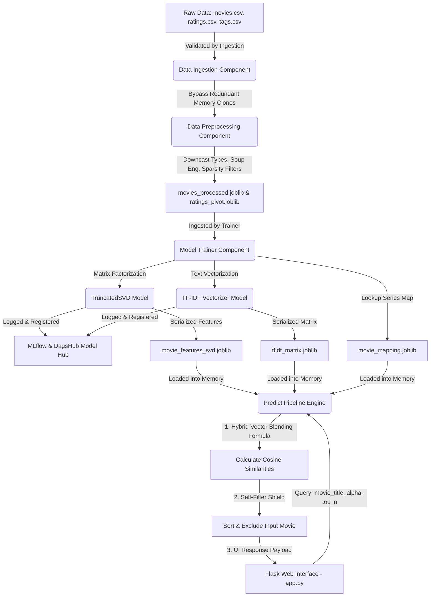

# Hybrid Movie Recommendation System

🚀 **Live Web Application**: [movie-recommendation-system.containers.snapdeploy.app](https://movie-recommendation-system.containers.snapdeploy.app)  
💻 **GitHub Repository**: [github.com/Dhruvit-Jalodhara/Movie-Recommendation-System](https://github.com/Dhruvit-Jalodhara/Movie-Recommendation-System)  
💻 **DagsHub Repository**: [dagshub.com/Dhruvit-Jalodhara/Movie-Recommendation-System](https://dagshub.com/Dhruvit-Jalodhara/Movie-Recommendation-System) 

📊 **MLflow Tracking Dashboard**: [dagshub.com/Dhruvit-Jalodhara/Movie-Recommendation-System.mlflow](https://dagshub.com/Dhruvit-Jalodhara/Movie-Recommendation-System.mlflow)  

An end-to-end, production-grade machine learning system that serves hybrid movie recommendations. The system blends collaborative filtering (via TruncatedSVD matrix factorization) and content-based text analysis (via TF-IDF on genres and movie tags) to deliver highly personalized recommendation vectors. It includes data versioning with DVC, experiment tracking/model registry with MLflow (integrated with DagsHub), a real-time web portal built with Flask, and a containerized deployment configuration.

---

## Table of Contents
- [Hybrid Movie Recommendation System](#hybrid-movie-recommendation-system)
  - [Table of Contents](#table-of-contents)
  - [System Architecture](#system-architecture)
  - [Project Key Features](#project-key-features)
  - [Project Directory Structure](#project-directory-structure)
  - [Mathematical Engine Details](#mathematical-engine-details)
  - [Installation \& Local Setup](#installation--local-setup)
    - [1. Clone the Project Workspace](#1-clone-the-project-workspace)
    - [2. Create and Activate Virtual Environment](#2-create-and-activate-virtual-environment)
    - [3. Install System Dependencies](#3-install-system-dependencies)
    - [4. Pull DVC-Tracked Data](#4-pull-dvc-tracked-data)
  - [ML Pipeline Workflows](#ml-pipeline-workflows)
    - [1. Data Ingestion](#1-data-ingestion)
    - [2. Data Preprocessing](#2-data-preprocessing)
    - [3. Model Training](#3-model-training)
    - [4. Predictive Pipeline](#4-predictive-pipeline)
  - [Running the Flask Web Application](#running-the-flask-web-application)
    - [Web Interface Usage](#web-interface-usage)
  - [Docker Production Deployment](#docker-production-deployment)
  - [MLflow \& DVC Tracking with DagsHub](#mlflow--dvc-tracking-with-dagshub)
    - [MLflow Logging Registry](#mlflow-logging-registry)
    - [DVC Storage Location](#dvc-storage-location)

---

## System Architecture

The following diagram illustrates the flow of data, from ingestion of DVC-tracked datasets through preprocessing, model training, artifact registration in MLflow, and the real-time inference loop served by the Flask web application.



---

## Project Key Features

- **Hybrid Recommendation Engine**: Blends behavioral collaborative patterns with metadata-driven similarity vectors using a dynamically adjustable parameter $\alpha$ ($Hybrid\_Score = \alpha \cdot Collaborative + (1 - \alpha) \cdot Content$).
- **Sparsity Mitigation & Thresholding**: Applies rating threshold filters (keeping users with $\ge 50$ ratings and movies with $\ge 50$ ratings) to dramatically reduce matrix sparsity and optimize recommendation relevance.
- **Memory-Safe Computations**: Downcasts numerical representations (e.g. `float32`, `int32`) and compresses large matrices into standard compressed sparse row (CSR) format via SciPy, avoiding RAM overflow.
- **Automated DVC Downloader**: Falls back to downloading missing artifacts directly from the DagsHub remote workspace over HTTP if local caches are missing during deployment.
- **DagsHub & MLflow Tracking**: Logs hyperparameters (`n_components`, `random_state`, `stop_words`), metrics (batch Mean Squared Error, catalog coverage percentage), and registers model binaries in the cloud registry.
- **Production Web Interface**: Clean, modern Flask dashboard utilizing custom CSS files with dynamic percentage-based similarity meters for TF-IDF, SVD, and Combined scores.
- **Isolated Containment**: Includes a `Dockerfile` optimized for standard light production ports (e.g. Hugging Face Spaces port 7860).

---

## Project Directory Structure

```text
├── .dvc/                             # DVC configuration and metadata
├── movie dataset/                    # Data directory (tracked via DVC)
│   ├── raw/                          # Raw CSV files (movies.csv, ratings.csv, tags.csv)
│   └── processed/                    # Processed interim data files
├── notebook/                         # Jupyter Notebooks for prototyping & EDA
│   ├── 01_EDA.ipynb
│   ├── 02_model_training.ipynb
│   ├── 03_content_based.ipynb
│   └── 04_hybrid_system.ipynb
├── src/                              # Core Python source packages
│   ├── __init__.py
│   ├── exception.py                  # Custom error propagation and tracing utilities
│   ├── logger.py                     # Standard logging system configuration
│   ├── utils.py                      # Serialization and chunked metric utilities
│   ├── components/                   # Core modular ML pipeline components
│   │   ├── __init__.py
│   │   ├── data_ingestion.py         # Validates and maps raw datasets
│   │   ├── data_preprocessing.py     # Preprocesses, downsizes, and generates metadata soup
│   │   └── model_trainer.py          # Fits SVD & TF-IDF, logs metrics to MLflow
│   └── pipeline/                     # Workflow orchestrations
│       ├── __init__.py
│       ├── train_pipeline.py         # End-to-end retraining orchestrator
│       └── predict_pipeline.py       # Real-time hybrid inference pipeline
├── static/                           # Flask web server static design assets
│   └── css/                          # Custom stylesheet rules
│       ├── home.css
│       ├── predict.css
│       └── results.css
├── templates/                        # Flask server HTML templates
│   ├── home.html                     # Project dashboard intro page
│   ├── predict.html                  # Profile customization & query panel
│   └── results.html                  # Similarity meter output cards
├── Dockerfile                        # Containerized application deployment descriptor
├── requirements.txt                  # Complete list of Python libraries needed
├── setup.py                          # Setup configuration to install local module dependencies
└── README.md                         # Project documentation (this file)
```

---

## Mathematical Engine Details

The hybrid engine coordinates two primary mathematical spaces:

1. **Collaborative Space (SVD)**:
   - SVD reduces the sparse interaction matrix $R$ (dimension $M \times U$) into dense latent features:
     $$R \approx W \times H$$
     where $W$ is the movie feature matrix of dimensions $M \times k$ (with $k=50$ components) and $H$ is the user components matrix ($k \times U$).
   - For a given movie $i$, the similarity with other movies is computed as the Cosine Similarity over its $k$-dimensional latent vector:
     $$Sim_{SVD}(i, j) = \frac{\vec{w}_i \cdot \vec{w}_j}{\|\vec{w}_i\| \|\vec{w}_j\|}$$

2. **Content-Based Space (TF-IDF)**:
   - A metadata soup is constructed for each movie by merging text tags and genres.
   - The TF-IDF Vectorizer evaluates terms to produce a sparse document-term frequency matrix.
   - Content similarity is computed using the linear kernel (equivalent to Cosine Similarity on normalized vectors):
     $$Sim_{TFIDF}(i, j) = \cos(\vec{t}_i, \vec{t}_j)$$

3. **Hybrid Linear Blend**:
   - The final ranking score is calculated using the linear equation controlled by parameter $\alpha \in [0, 1]$:
     $$Score_{Hybrid}(i, j) = \alpha \cdot Sim_{SVD}(i, j) + (1 - \alpha) \cdot Sim_{TFIDF}(i, j)$$

---

## Installation & Local Setup

### 1. Clone the Project Workspace
```bash
git clone https://github.com/Dhruvit-Jalodhara/Movie-Recommendation-System.git
cd Movie-Recommendation-System
```

### 2. Create and Activate Virtual Environment
```bash
# On macOS/Linux
python3 -m venv venv
source venv/bin/activate

# On Windows
python -m venv venv
venv\Scripts\activate
```

### 3. Install System Dependencies
Install requirements and set up the package in editable mode:
```bash
pip install -r requirements.txt
pip install -e .
```

### 4. Pull DVC-Tracked Data
Make sure you have DVC installed and configured, then run:
```bash
dvc pull
```
*Note: If you do not have DVC configured locally, the prediction pipeline contains an automatic downloader fallback that fetches precomputed serialized `.joblib` objects directly from DagsHub when boot-up triggers.*

---

## ML Pipeline Workflows

The workflow is written in modular components in the `src/` directory.

### 1. Data Ingestion
- **File**: `src/components/data_ingestion.py`
- **Purpose**: Validates the presence of raw files (`movies.csv`, `ratings.csv`, and `tags.csv`) under `movie dataset/raw/` to ensure the project datasets are pulled locally before processing.

### 2. Data Preprocessing
- **File**: `src/components/data_preprocessing.py`
- **Steps**:
  - Drops metadata timestamps and downcasts integer indices/ratings to `int32`/`float32`.
  - Aggregates user tags, sanitizes spacing (replacing space indicators with `_` and vertical pipes with spaces), and creates `metadata_soup`.
  - Filters out records matching movies or users with fewer than 50 total rating reviews.
  - Generates the compressed SciPy pivot CSR rating matrix (`ratings_pivot.joblib`) and processed movies dataframe (`movies_processed.joblib`).

### 3. Model Training
- **File**: `src/components/model_trainer.py`
- **Steps**:
  - Ingests the processed matrices and registers metadata mappings.
  - Instantiates `TruncatedSVD(n_components=50, random_state=42)` and fits it on user interactions.
  - Instantiates `TfidfVectorizer(stop_words='english')` and fits it on `metadata_soup`.
  - Computes Mean Squared Error (MSE) via memory-safe batch processing.
  - Computes catalogue coverage percentage using a random subset of movies.
  - Logs metrics and models to DagsHub MLflow Server registry, and serializes artifacts into `artifacts/`.

To trigger the end-to-end retraining pipeline, execute:
```bash
python src/pipeline/train_pipeline.py
```

### 4. Predictive Pipeline
- **File**: `src/pipeline/predict_pipeline.py`
- **Purpose**: Handles real-time hybrid cosine blending. Ingests user selections, aligns indexing differences between the TF-IDF space and SVD space, computes dynamic cosine rankings, and prevents self-recommendation through a filter shield.

---

## Running the Flask Web Application

To run the Flask application server locally:

```bash
python app.py
```

The server will start up on `http://localhost:7860` (or the port defined by the environment variable `PORT`).

### Web Interface Usage
1. **Home**: Introduces the architecture and engine specifications. Click **Get Started** to access the customization screen.
2. **Profile Customization**:
   - Choose a base movie from the verified database dropdown catalog.
   - Adjust the **Hybrid Linear Slider ($\alpha$)**:
     - Closer to **1.0**: Focuses heavily on user interaction behaviors (Collaborative).
     - Closer to **0.0**: Focuses strictly on genres and narrative keyword descriptors (Content-Based).
     - **0.5**: Evenly balanced blend.
   - Submit to calculate the top 5 recommendations.
3. **Results**: Presents recommendations inside responsive UI cards showing percentage meters for TF-IDF, SVD, and Combined confidence scores.

---

## Docker Production Deployment

This project includes a `Dockerfile` configuration. To build and run the Docker container locally:

```bash
# 1. Build the Docker image
docker build -t movie-recommender:latest .

# 2. Run the container exposing Hugging Face port 7860
docker run -p 7860:7860 movie-recommender:latest
```

---

## MLflow & DVC Tracking with DagsHub

The system integrates directly with DagsHub for remote metadata tracking and model registering.

### MLflow Logging Registry
- **URI / Dashboard**: [DagsHub MLflow Server](https://dagshub.com/Dhruvit-Jalodhara/Movie-Recommendation-System.mlflow)
- **Logged Parameters**:
  - `svd_n_components` (50)
  - `svd_random_state` (42)
  - `tfidf_stop_words` ("english")
- **Logged Metrics**:
  - `svd_reconstruction_mse` (Mean Squared Error of reconstructed matrix)
  - `svd_catalog_coverage_pct` (Percentage catalog items reachable)
- **Model Registry Names**:
  - `SVD_Collaborative_Engine`
  - `TFIDF_Content_Engine`

### DVC Storage Location
- **Remote**: [DagsHub DVC Storage](https://dagshub.com/Dhruvit-Jalodhara/Movie-Recommendation-System.dvc)
- Automatically manages heavy `.csv` inputs and model binaries tracking.
